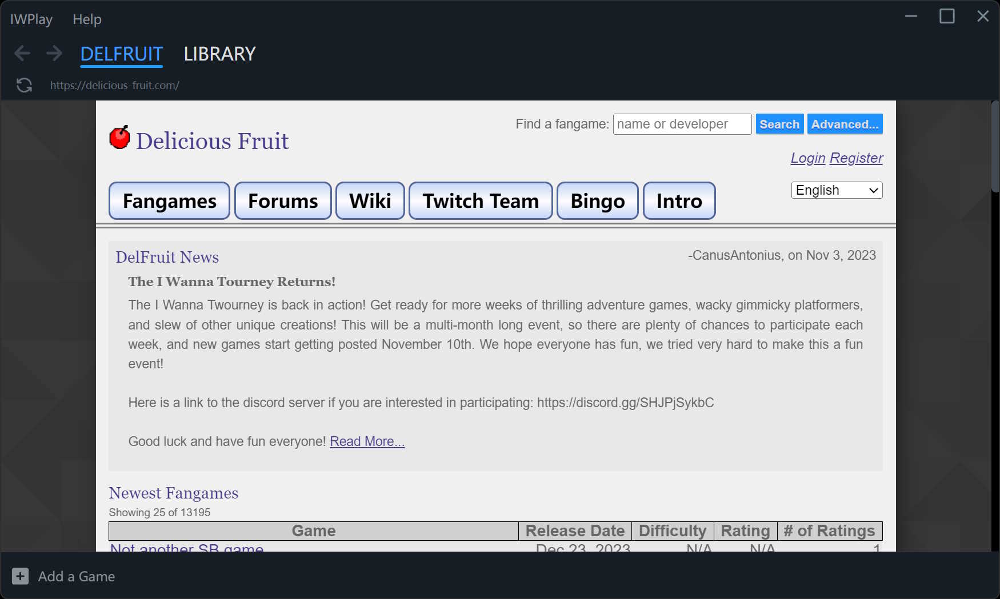

# IWPLAY

[](https://discord.gg/xW4mY652hC)


Experimental "I Wanna Fangames" Management Software



## Features (Current)

- Manage your fangames, install, uninstall, update...
- Browse the Delicious Fruit and I wanna wiki in the built-in browser
- Download and install fangames directly from the built-in browser
- Record your game time and play dates
- Sync favorite, clear, bookmark from DelFruit
- Apply Debugger Helper patch with one click

## Download

[Releases](https://github.com/cubeww/iwplay-electron/releases)

## Contributing

This project is still in the early stages of development and may be extremely unstable.

Please use the Github Issue tracker, or join the IWPlay discord channel.

## Development

vscode + typescript + electron-vite + vue3

## Build

1. Install node.js

2. Download or clone the repository

3. Open the repository in vscode

4. Execute once:

   ```sh
   npm install
   ```

5. To run, execute:

   ```sh
   npm run dev
   ```

6. To build, execute:

   ```sh
   npm run build:win
   ```

   This will create a zip in the **dist/** folder.

## Additional Credits

- [renex's dbghelper](https://github.com/omicronrex/dbghelper)

## License

MIT
